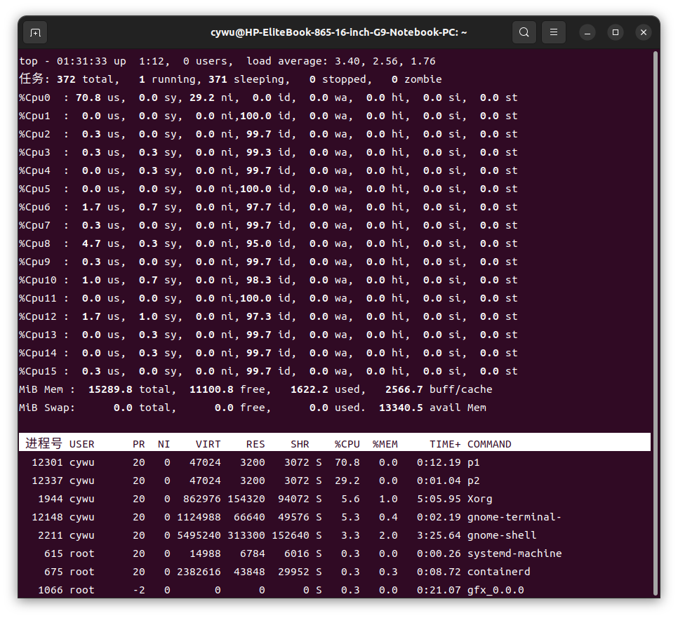
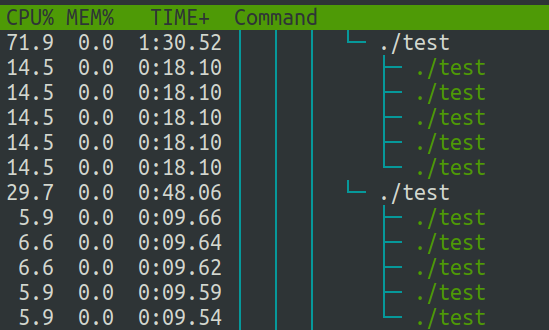
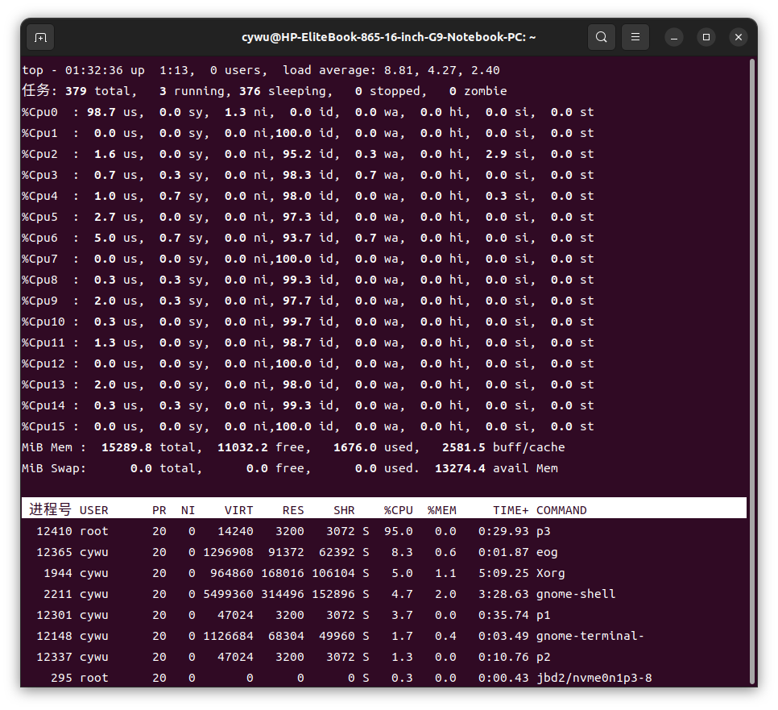

# CS3302 Project 2

## 实验要求

### 任务一

1. 创建5+5=10个CPU密集型线程/进程，并将他们绑定在同一个CPU核心上，修改这些进程 (线程) 的优先级使得
    其中5个进程占用大约70%的CPU资源，另外5个进程使用剩下的30%。在同一组中的进程应该具有
    相同的优先级。使用`top`或`htop`命令验证实验结果。

  

  

  上图为结果示例 (图一的`p1`, `p2`以及图二的两个`test`)。你可以使用自己编写的程序或任何已有的命令行工具来实现以上效果。

2. 在相同的CPU核心上，再创建一个实时进程，验证当这个进程在运行时，会抢占其他十个线程/进程。

  

  

  上图为结果示例 (图一的`p3`以及图二的`test1`即为新创建的实时进程)。

#### 实验提示
- 你如果打算使用命令行工具, 那么可以使用`taskset` 将进程绑定到指定CPU核心上, 使用`chrt`来创建实时进程。本任务不限制命令行工具的范围 (但应当至少能够在包管理器的默认源中找到, 并且你需要在实验报告中描述安装方法)。
- 创建实时线程需要root权限。

#### 提交内容

- 在实验报告中简要描述实验的过程, 实验中的思考以及实验中可能遇到的问题。
- CPU密集型程序的源码文件和创建实时进程的源码文件/脚本文件。

### 任务二

#### 实验内容
修改Linux源代码，记录每个进程被调度的次数。

#### 具体要求

- 在线程的`task_struct`结构体中添加数据成员变量`int ctx` ，用于记录进程的调度次数。
- 在进程对应的`/proc/<PID>/` 目录下添加只读文件`/proc/<PID>/ctx`。
- 当读取文件`/proc/<PID>/ctx` 时，输出进程当前的调度次数。

#### 实验提示

- 进程是如何管理的？阅读Linux源码中`task_struct` 的定义，在合适的位置声明`ctx` 成员, 源码文件`include/linux/sched.h`, [https://elixir.bootlin.com/linux/v6.2.9/source/include/linux/sched.h#L737](https://elixir.bootlin.com/linux/v6.2.9/source/include/linux/sched.h#L737)。
- 进程是如何被创建的？在进程创建的函数中，在合适的位置初始化`ctx` ，源码文件`kernel/fork.c`, [https://elixir.bootlin.com/linux/v6.2.9/source/kernel/fork.c](https://elixir.bootlin.com/linux/v6.2.9/source/kernel/fork.c)。
- 进程是如何被调度的？在调度进程的函数中，找到合适的位置，更新`ctx `，源码文件`kernel/sched/core.c`, [https://elixir.bootlin.com/linux/v6.2.9/source/kernel/sched/core.c](https://elixir.bootlin.com/linux/v6.2.9/source/kernel/sched/core.c)。
- 每个进程在`/proc/`目录下都有自己的目录，那么这些目录是在哪里被创建的？如何⾃定义⽂件操作函数？参考`pid_entry` 和`tgid_base_stuff` ，源码文件`fs/proc/base.c`, [https://elixir.bootlin.com/linux/v6.2.9/source/fs/proc/base.c#L3238](https://elixir.bootlin.com/linux/v6.2.9/source/fs/proc/base.c#L3238)。
- 这个任务需要改动的代码很少，但需要阅读一定的Linux源码。

示例测试进程代码如下:

```cpp
#include <stdio.h>
int main()
{
    while (true)
        getchar();
    return 0;
}
```

#### 提交内容

- 在实验报告中描述修改思路以及具体修改的代码部分（patch文件, 生成方式如下）。
- 实验过程中遇到的问题以及实验结果。

#### 实验指南

为了方便批改, 本实验推荐使用Linux内核 (版本`6.2.9`), 该内核代码已经包含在本课程的GitHub仓库中, 无需自行从官网下载. 本任务推荐使用最新版的`Ubuntu 22.04`操作系统 (仅为建议, 你可以根据自己的喜好, 选择其他的发行版), 并安装`git`. 具体实验步骤如下:

1. 下载/克隆 [https://github.com/prcwcy/CS3302-2024-Spring](https://github.com/prcwcy/CS3302-2024-Spring) 中的代码, 切换到`project2`目录, 运行`make init`, 将会生成包含Linux内核代码的目录`linux-版本号`.
2. 在上一步生成的目录中, 继续实验, 修改内核代码.
3. 实验完成后, 运行`make patch`, 生成`submission.patch`文件, 该文件将包含你对内核代码的所有修改.
4. 在最终提交的作业中, 包含该`submission.patch`文件 (放在源代码文件夹下).

(注: 如果你已经习惯于使用git工具, 你可以无视上面的要求, 根据提供的Makefile的写法, 按照自己的喜好的方式使用git, 并自行生成`submission.patch`文件)

---

**为了照顾一些基础薄弱的同学, 如果你不熟悉git工具的使用, 或者想使用其他版本的内核, 你也可以直接提交你修改的linux内核中的源代码文件.**

提示: 在编译内核时, 你可以通过`make localmodconfig`, 避免生成不需要的内核模块, 以减少编译内核的时间. 参见: [https://unix.stackexchange.com/questions/253245/what-does-make-localmodconfig-do](https://unix.stackexchange.com/questions/253245/what-does-make-localmodconfig-do)

## 实验提交

提交渠道：Canvas
提交⽂件： `学号_project2.zip` ，源码⽂件夹 `学号_project2_src` （所有源代码文件以及
Makefile），实验报告 `学号_project2_report.pdf `。
实验报告内容包括但不限于实验过程、实验效果截图、实验⼼得（实验过程中遇到的困难、解决的方
法，或者是值得分享的小技巧）。


